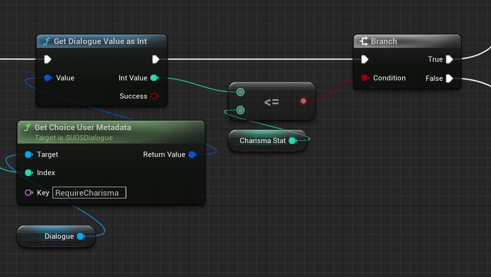

# Comment Lines

Comment lines are ignored by the SUDS importer, and are there just for your
own use.

You add comments to your script by starting the line with a hash/pound (`#`) character:

```yaml
# This is a Comment
# More comments here
NPC: Did you say something?
```

It doesn't matter how you indent the comment line. 

## Comments must be on their OWN line

You ***cannot*** add comments to the end of other types of lines:

```yaml
NPC: Oops  # THIS IS NOT VALID
```

Although other languages support this, SUDS does not right now. 

> The reason is mainly that we reserve the end of lines to append
> [localisation](Localisation.md) tags, and supporting both trailing line
> comments and these would over-complicate things. 

## Special Comments

There are some comment line formats in SUDS which are special and add additional functionality:

* [Translator Comments](#translator-comments)
* [User Metadata](#user-metadata)

See the linked sections below for more information.

### Translator Comments

SUDS supports using a specialised comment syntax to communicate additional information about lines
to translators. These comment lines are prefixed with `#=` or `#+` instead of just the plain `#`. For example: 

```yaml
#= This line is delivered jokingly, between friends
NPC: Oi, smeghead!
```

More information can be found in the dedicated [Translator Comments](LocalisationTranslatorComments.md)
section.

### User Metadata

You can attach additional metadata to [speaker lines](SpeakerLines.md) and [choices](ChoiceLines.md) to give your
game more information about those lines, which can in turn change how they're displayed or handled.

User metadata is one or more special comments above a speaker or choice line, prefixed with `#%` instead of the usual
`#`. Each line is a key/value pair, which may or may not contain an `=` sign, and which has a similar syntax to [setting variables](SetLines.md):

```yaml
#% IsGreeting = true
NPC: Hello!
```

A `#%` user metadata line only applies to the *next* speaker line, or choice line following it. It effectively attaches
a named value directly to that line, much like a [dialogue variable](Variables.md), but the scope is much tighter: solely that line.
The `=` sign is optional, and the value on the right hand side can include [variables](Variables.md) and [expressions](Expressions.md).

So why would you want line-specific user metadata? Well, let's take a RPG example, where there are choices in the dialogue
that you can only select if you have suitable character statistics. You *could* implement that using [conditional lines](ConditionalLines.md),
and omit certain choices using `if` tests. But, if instead you attached metadata to choices, you could allow your game
to still be able to see the choices, and display them in a disabled form in the UI, perhaps with an explanation of 
why they're not available to your specific character. Let's do something like that; first the script:

```yaml
#% IsGreeting = true
NPC: Hello!
  #% RequireCharisma = 5
  * Standard choice
     Player: Hello!
  #% RequireCharisma = {HighCharisma} + 1
  #% IsCheeky true
  * Cheeky Choice
     Player: Well, hello yourself
```

Now in our Blueprint, we could check the metadata on the choice lines, and use that to determine whether we should 
allow the player to select them or not (and explain why):



There is a similar interface for retrieving metadata on the current speaker line of course. 
This is just one example, you can use any metadata you like to refine your game's behaviour depending on information 
associated with specific lines in the script.

### See Also:
* [Translator Comments](LocalisationTranslatorComments.md)
* [Speaker Lines](SpeakerLines.md)
* [Choices](ChoiceLines.md)
* [Variables](Variables.md)
* [Script Reference](ScriptReference.md)
* [Running Dialogue in UE](RunningDialogue.md)
* [Localisation](Localisation.md)
* [Full Documentation Index](../Index.md)